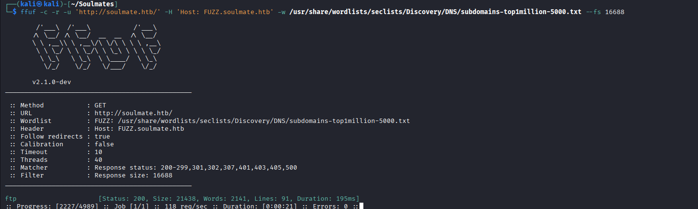
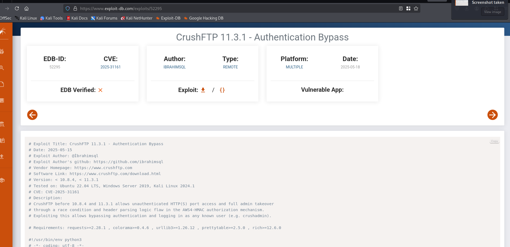
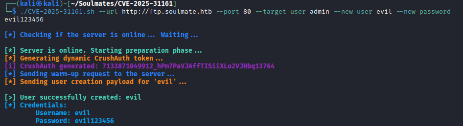
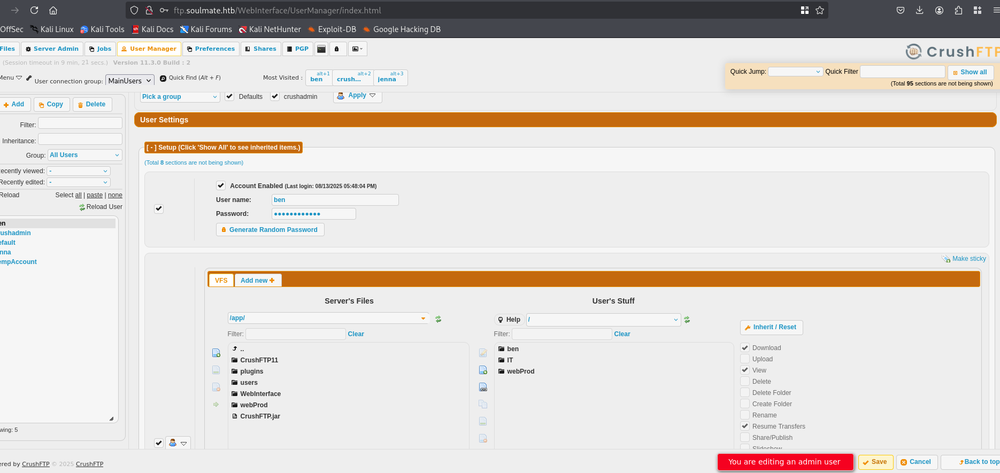
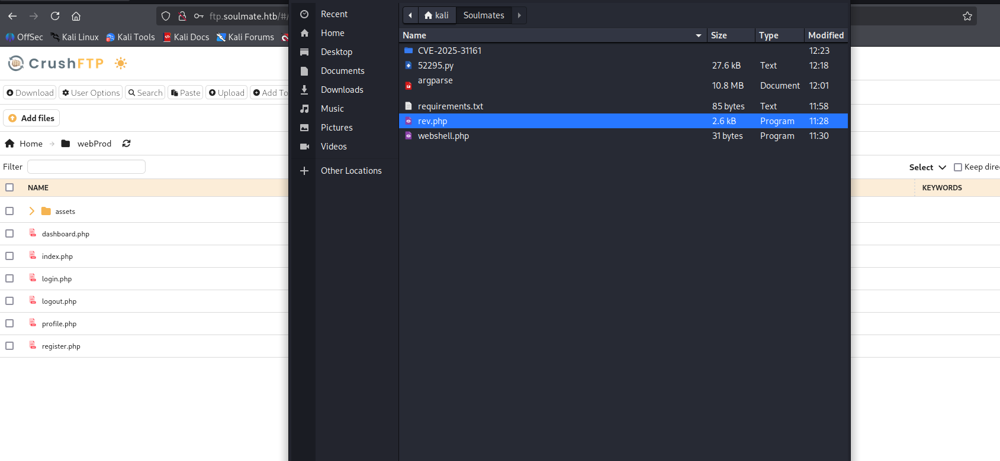
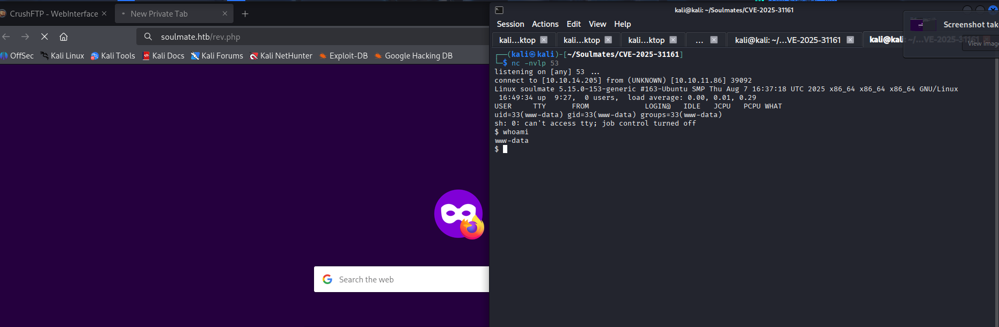
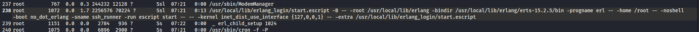
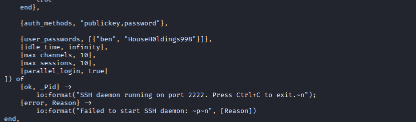

# Soulmates

IP Address: 10.10.11.86

Nmap Scan:
```
└─$ nmap -sC -A 10.10.11.86
Starting Nmap 7.95 ( https://nmap.org ) at 2025-10-11 11:01 EDT
Nmap scan report for 10.10.11.86 (10.10.11.86)
Host is up (0.18s latency).
Not shown: 998 closed tcp ports (reset)
PORT   STATE SERVICE VERSION
22/tcp open  ssh     OpenSSH 8.9p1 Ubuntu 3ubuntu0.13 (Ubuntu Linux; protocol 2.0)
| ssh-hostkey: 
|   256 3e:ea:45:4b:c5:d1:6d:6f:e2:d4:d1:3b:0a:3d:a9:4f (ECDSA)
|_  256 64:cc:75:de:4a:e6:a5:b4:73:eb:3f:1b:cf:b4:e3:94 (ED25519)
80/tcp open  http    nginx 1.18.0 (Ubuntu)
|_http-server-header: nginx/1.18.0 (Ubuntu)
|_http-title: Did not follow redirect to http://soulmate.htb/
Device type: general purpose|router
Running: Linux 4.X|5.X, MikroTik RouterOS 7.X
OS CPE: cpe:/o:linux:linux_kernel:4 cpe:/o:linux:linux_kernel:5 cpe:/o:mikrotik:routeros:7 cpe:/o:linux:linux_l:5.6.3
OS details: Linux 4.15 - 5.19, MikroTik RouterOS 7.2 - 7.5 (Linux 5.6.3)
Network Distance: 2 hops
Service Info: OS: Linux; CPE: cpe:/o:linux:linux_kernel

TRACEROUTE (using port 1025/tcp)
HOP RTT       ADDRESS
1   192.19 ms 10.10.14.1 (10.10.14.1)
2   192.33 ms 10.10.11.86 (10.10.11.86)

OS and Service detection performed. Please report any incorrect results at https://nmap.org/submit/ .
Nmap done: 1 IP address (1 host up) scanned in 17.14 seconds

```

Write the line into /etc/hosts then.

Register to the web application:


Tried a webshell, nothing happened.

Subdomain enumeration:


Go to /etc/hosts

There is a Crush FTP service. Try the exploit: 


Resource: https://www.exploit-db.com/exploits/52295 --> not working

Resource: https://github.com/f4dee-backup/CVE-2025-31161




Change the password of ben: ben:ben123456789


Login to Crush FTP with ben creds and upload the rev shell (php)




Revshell:


Resource: https://blog.ropnop.com/upgrading-simple-shells-to-fully-interactive-ttys/


According to linpeas.sh:




The file read:



Credentials: "ben", "HouseH0ldings998"

Then try from ssh: 
> ssh ben@127.0.0.1 -p 2222 (with the same password)

```
(ssh_runner@soulmate)8> os:cmd("ls  /root").
"root.txt\nscripts\n"
(ssh_runner@soulmate)9> os:cmd("cat /root/root.txt").
```