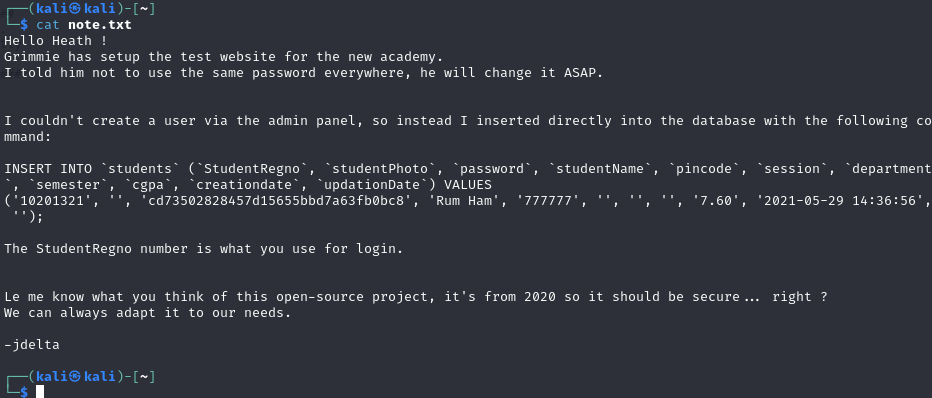
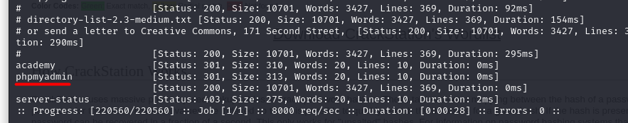
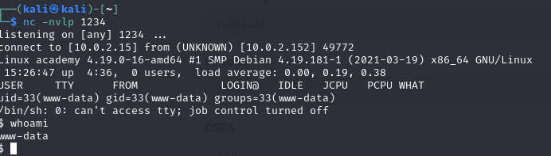
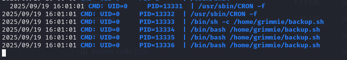
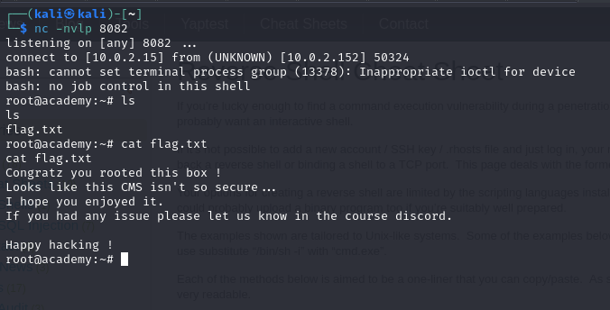

# Academy machine

IP address: 10.0.2.152

```
└─$ sudo arp-scan -l            
Interface: eth0, type: EN10MB, MAC: 08:00:27:d2:26:79, IPv4: 10.0.2.15
WARNING: Cannot open MAC/Vendor file ieee-oui.txt: Permission denied
WARNING: Cannot open MAC/Vendor file mac-vendor.txt: Permission denied
Starting arp-scan 1.10.0 with 256 hosts (https://github.com/royhills/arp-scan)
10.0.2.1        52:54:00:12:35:00       (Unknown: locally administered)
10.0.2.2        52:54:00:12:35:00       (Unknown: locally administered)
10.0.2.3        08:00:27:e6:9a:7b       (Unknown)
10.0.2.152      08:00:27:47:22:9e       (Unknown)

4 packets received by filter, 0 packets dropped by kernel
Ending arp-scan 1.10.0: 256 hosts scanned in 1.856 seconds (137.93 hosts/sec). 4 responded

```

Nmap Scan:

```
└─$ nmap -sC -sV 10.0.2.152    
Starting Nmap 7.94SVN ( https://nmap.org ) at 2025-09-19 14:50 EDT
Nmap scan report for 10.0.2.152 (10.0.2.152)
Host is up (0.00041s latency).
Not shown: 997 closed tcp ports (conn-refused)
PORT   STATE SERVICE VERSION
21/tcp open  ftp     vsftpd 3.0.3
| ftp-syst: 
|   STAT: 
| FTP server status:
|      Connected to ::ffff:10.0.2.15
|      Logged in as ftp
|      TYPE: ASCII
|      No session bandwidth limit
|      Session timeout in seconds is 300
|      Control connection is plain text
|      Data connections will be plain text
|      At session startup, client count was 2
|      vsFTPd 3.0.3 - secure, fast, stable
|_End of status
| ftp-anon: Anonymous FTP login allowed (FTP code 230)
|_-rw-r--r--    1 1000     1000          776 May 30  2021 note.txt
22/tcp open  ssh     OpenSSH 7.9p1 Debian 10+deb10u2 (protocol 2.0)
| ssh-hostkey: 
|   2048 c7:44:58:86:90:fd:e4:de:5b:0d:bf:07:8d:05:5d:d7 (RSA)
|   256 78:ec:47:0f:0f:53:aa:a6:05:48:84:80:94:76:a6:23 (ECDSA)
|_  256 99:9c:39:11:dd:35:53:a0:29:11:20:c7:f8:bf:71:a4 (ED25519)
80/tcp open  http    Apache httpd 2.4.38 ((Debian))
|_http-title: Apache2 Debian Default Page: It works
|_http-server-header: Apache/2.4.38 (Debian)
Service Info: OSs: Unix, Linux; CPE: cpe:/o:linux:linux_kernel

Service detection performed. Please report any incorrect results at https://nmap.org/submit
Nmap done: 1 IP address (1 host up) scanned in 7.49 seconds
```


By watching the nmap output there is an interesting note - note.txt file in ftp server.

Resource: https://hackviser.com/tactics/pentesting/services/ftp



There is a note. Useful string: cd73502828457d15655bbd7a63fb0bc8

Try to check with a hash-identifier tool in kali. After open https://crackstation.net/ to decrypt the MD5 hash - student.

Command: ffuf -w /usr/share/wordlists/dirbuster/directory-list-2.3-medium.txt:FUZZ -u http://10.0.2.152/FUZZ


This one is interesting



Looking first on /academy directory, there is a Login page with valid credentials: 10201321:student

There is a function of changing or set a photo or avatar.

Try toupload the reverse shell:https://github.com/pentestmonkey/php-reverse-shell




Privilege Escalation:

start a server on attacker machine with python:

python3 -m http.server 8081

Then downloas linpeas.sh
Resource:  https://github.com/peass-ng/PEASS-ng/releases/tag/20250904-27f4363e

mysql password: My_V3ryS3cur3_P4ss
User: grimmie

By using pspy because of the backup.sh:



Then use the bash to get the reverse shell from pentestmonkey:


