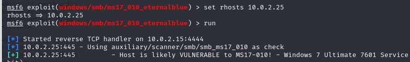

# Blue 

IP Address (Target): 10.0.2.25

nmap command:
```
└─$ nmap -sC -sV 10.0.2.25     
Starting Nmap 7.94SVN ( https://nmap.org ) at 2025-09-19 08:25 EDT
Nmap scan report for 10.0.2.25 (10.0.2.25)
Host is up (0.00051s latency).
Not shown: 992 closed tcp ports (conn-refused)
PORT      STATE SERVICE      VERSION
135/tcp   open  msrpc        Microsoft Windows RPC
139/tcp   open  netbios-ssn  Microsoft Windows netbios-ssn
445/tcp   open  microsoft-ds Windows 7 Ultimate 7601 Service Pack 1 microsoft-ds (workgroup: WORKGROUP)
49152/tcp open  msrpc        Microsoft Windows RPC
49153/tcp open  msrpc        Microsoft Windows RPC
49154/tcp open  msrpc        Microsoft Windows RPC
49155/tcp open  msrpc        Microsoft Windows RPC
49157/tcp open  msrpc        Microsoft Windows RPC
Service Info: Host: WIN-845Q99OO4PP; OS: Windows; CPE: cpe:/o:microsoft:windows

Host script results:
|_clock-skew: mean: 1h20m10s, deviation: 2h18m34s, median: 9s
|_nbstat: NetBIOS name: WIN-845Q99OO4PP, NetBIOS user: <unknown>, NetBIOS MAC: 08:00:27:7d:9c:0a (Oracle VirtualBox virtual NIC)
| smb2-security-mode: 
|   2:1:0: 
|_    Message signing enabled but not required
| smb2-time: 
|   date: 2025-09-19T12:26:36
|_  start_date: 2025-09-19T12:18:31
| smb-os-discovery: 
|   OS: Windows 7 Ultimate 7601 Service Pack 1 (Windows 7 Ultimate 6.1)
|   OS CPE: cpe:/o:microsoft:windows_7::sp1
|   Computer name: WIN-845Q99OO4PP
|   NetBIOS computer name: WIN-845Q99OO4PP\x00
|   Workgroup: WORKGROUP\x00
|_  System time: 2025-09-19T08:26:36-04:00
| smb-security-mode: 
|   account_used: guest
|   authentication_level: user
|   challenge_response: supported
|_  message_signing: disabled (dangerous, but default)

Service detection performed. Please report any incorrect results at https://nmap.org/submit/ .
Nmap done: 1 IP address (1 host up) scanned in 65.79 seconds

```

This is a machine a part of the Forest of the Active Directory

Probable search: https://www.exploit-db.com/exploits/47176

Watched through the vulnerability - Eternalblue




Resources: 
https://www.sciencedirect.com/topics/computer-science/meterpreter-shell
https://www.hypr.com/security-encyclopedia/eternalblue
https://www.sentinelone.com/blog/eternalblue-nsa-developed-exploit-just-wont-die/