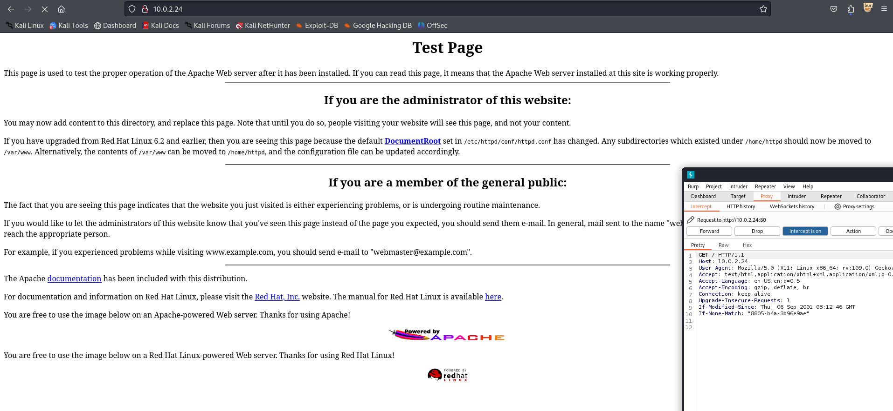
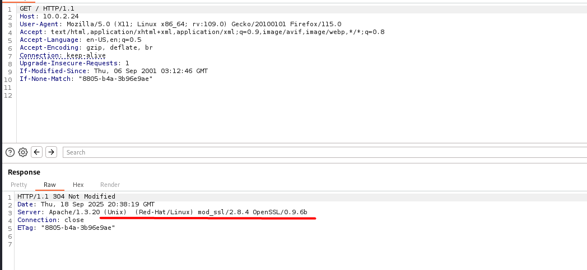
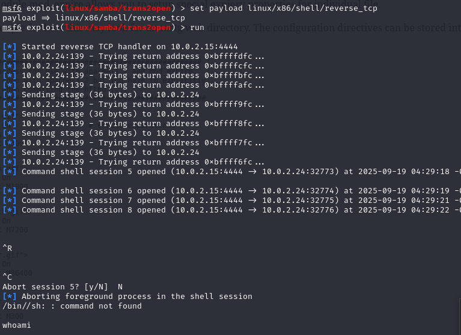
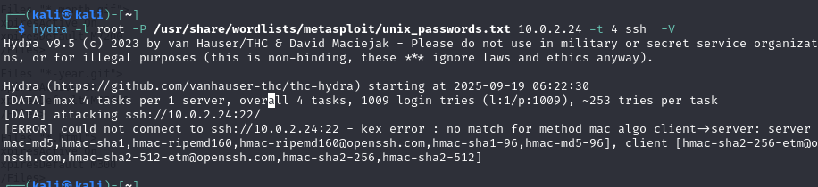

# Kioptrix Machine

First install the lab. 
Download the .ova file and set up it to NATNetwork (or private local network) the same network with Kali machine

It could be run different commands:

``` 
sudo arp-scan -l 

Interface: eth0, type: EN10MB, MAC: 08:00:27:d2:26:79, IPv4: 10.0.2.15
WARNING: Cannot open MAC/Vendor file ieee-oui.txt: Permission denied
WARNING: Cannot open MAC/Vendor file mac-vendor.txt: Permission denied
Starting arp-scan 1.10.0 with 256 hosts (https://github.com/royhills/arp-scan)
10.0.2.1        52:54:00:12:35:00       (Unknown: locally administered)
10.0.2.2        52:54:00:12:35:00       (Unknown: locally administered)
10.0.2.3        08:00:27:e6:9a:7b       (Unknown)
10.0.2.24       08:00:27:f1:e9:f7       (Unknown) # This one is the most interesting

```
Resource: 
arp-scan is a simple tool that can be used list the IP addresses (and devices) used in a network. It works by sender ARP 'who-has' requestsfor every IP address of the subnet. I t will reply with ARP reply packet. 

Resource: https://cylab.be/blog/220/network-reconnaissance-with-arp-scan

``` 
sudo netdiscover -r 10.0.2.0/24

 Currently scanning: Finished!   |   Screen View: Unique Hosts 5 Captured ARP Req/Rep packets, from 4 hosts.   
 Total size: 300                                                  
 _____________________________________________________________________________
   IP            At MAC Address     Count     Len  MAC Vendor / Hostname      
 -----------------------------------------------------------------------------
 10.0.2.1        52:54:00:12:35:00      2     120  Unknown vendor                                                 
 10.0.2.2        52:54:00:12:35:00      1      60  Unknown vendor                                                 
 10.0.2.3        08:00:27:e6:9a:7b      1      60  PCS Systemtechnik GmbH                                         
 10.0.2.24       08:00:27:f1:e9:f7      1      60  PCS Systemtechnik GmbH 

```

netdiscover - mostly used to target IP address

Resource: https://www.hackercoolmagazine.com/beginners-guide-to-netdiscover/?srsltid=AfmBOooU4nUloOGNQrjnOwA1J-Pfz_tHLai_Uz63SjVUs_W9sMaWrU26


So, by using the defualt nmap command with flags -sC and -sV:

```
└─$ nmap -sC -sV 10.0.2.24                                              
Starting Nmap 7.94SVN ( https://nmap.org ) at 2025-09-18 11:47 EDT
Nmap scan report for 10.0.2.24 (10.0.2.24)
Host is up (0.90s latency).
Not shown: 994 closed tcp ports (conn-refused)
PORT      STATE SERVICE     VERSION
22/tcp    open  ssh         OpenSSH 2.9p2 (protocol 1.99)
| ssh-hostkey: 
|   1024 b8:74:6c:db:fd:8b:e6:66:e9:2a:2b:df:5e:6f:64:86 (RSA1)
|   1024 8f:8e:5b:81:ed:21:ab:c1:80:e1:57:a3:3c:85:c4:71 (DSA)
|_  1024 ed:4e:a9:4a:06:14:ff:15:14:ce:da:3a:80:db:e2:81 (RSA)
|_sshv1: Server supports SSHv1
80/tcp    open  http        Apache httpd 1.3.20 ((Unix)  (Red-Hat/Linux) mod_ssl/2.8.4 OpenSSL/0.9.6b)
| http-methods: 
|_  Potentially risky methods: TRACE
|_http-title: Test Page for the Apache Web Server on Red Hat Linux
|_http-server-header: Apache/1.3.20 (Unix)  (Red-Hat/Linux) mod_ssl/2.8.4 OpenSSL/0.9.6b
111/tcp   open  rpcbind     2 (RPC #100000)
| rpcinfo: 
|   program version    port/proto  service
|   100000  2            111/tcp   rpcbind
|   100000  2            111/udp   rpcbind
|   100024  1          32768/tcp   status
|_  100024  1          32772/udp   status
139/tcp   open  netbios-ssn Samba smbd (workgroup: MYGROUP)
443/tcp   open  ssl/https   Apache/1.3.20 (Unix)  (Red-Hat/Linux) mod_ssl/2.8.4 OpenSSL/0.9.6b
|_ssl-date: 2025-09-18T19:48:01+00:00; +4h00m00s from scanner time.
| ssl-cert: Subject: commonName=localhost.localdomain/organizationName=SomeOrganization/stateOrProvinceName=SomeState/countryName=--
| Not valid before: 2009-09-26T09:32:06
|_Not valid after:  2010-09-26T09:32:06
|_http-title: 400 Bad Request
| sslv2: 
|   SSLv2 supported
|   ciphers: 
|     SSL2_RC2_128_CBC_WITH_MD5
|     SSL2_RC4_128_EXPORT40_WITH_MD5
|     SSL2_DES_192_EDE3_CBC_WITH_MD5
|     SSL2_RC4_64_WITH_MD5
|     SSL2_RC2_128_CBC_EXPORT40_WITH_MD5
|     SSL2_RC4_128_WITH_MD5
|_    SSL2_DES_64_CBC_WITH_MD5
|_http-server-header: Apache/1.3.20 (Unix)  (Red-Hat/Linux) mod_ssl/2.8.4 OpenSSL/0.9.6b
32768/tcp open  status      1 (RPC #100024)

Host script results:
|_smb2-time: Protocol negotiation failed (SMB2)
|_clock-skew: 3h59m59s
|_nbstat: NetBIOS name: KIOPTRIX, NetBIOS user: <unknown>, NetBIOS MAC: <unknown> (unknown)

Service detection performed. Please report any incorrect results at https://nmap.org/submit/ .
Nmap done: 1 IP address (1 host up) scanned in 18.91 seconds

```

By checking the 80 port, see:
 

Default Apache page

```
└─$ nikto -host 10.0.2.24
- Nikto v2.5.0
---------------------------------------------------------------------------
+ Target IP:          10.0.2.24
+ Target Hostname:    10.0.2.24
+ Target Port:        80
+ Start Time:         2025-09-18 12:24:28 (GMT-4)
---------------------------------------------------------------------------
+ Server: Apache/1.3.20 (Unix)  (Red-Hat/Linux) mod_ssl/2.8.4 OpenSSL/0.9.6b
+ /: Server may leak inodes via ETags, header found with file /, inode: 34821, size: 2890, mtime: Wed Sep  5 23:12:46 2001. See: http://cve.mitre.org/cgi-bin/cvename.cgi?name=CVE-2003-1418
+ /: The anti-clickjacking X-Frame-Options header is not present. See: https://developer.mozilla.org/en-US/docs/Web/HTTP/Headers/X-Frame-Options
+ /: The X-Content-Type-Options header is not set. This could allow the user agent to render the content of the site in a different fashion to the MIME type. See: https://www.netsparker.com/web-vulnerability-scanner/vulnerabilities/missing-content-type-header/
+ /: Apache is vulnerable to XSS via the Expect header. See: http://cve.mitre.org/cgi-bin/cvename.cgi?name=CVE-2006-3918
+ mod_ssl/2.8.4 appears to be outdated (current is at least 2.9.6) (may depend on server version).
+ Apache/1.3.20 appears to be outdated (current is at least Apache/2.4.54). Apache 2.2.34 is the EOL for the 2.x branch.
+ OpenSSL/0.9.6b appears to be outdated (current is at least 3.0.7). OpenSSL 1.1.1s is current for the 1.x branch and will be supported until Nov 11 2023.
+ Apache/1.3.20 - Apache 1.x up 1.2.34 are vulnerable to a remote DoS and possible code execution.
+ Apache/1.3.20 - Apache 1.3 below 1.3.27 are vulnerable to a local buffer overflow which allows attackers to kill any process on the system.
+ Apache/1.3.20 - Apache 1.3 below 1.3.29 are vulnerable to overflows in mod_rewrite and mod_cgi.
+ mod_ssl/2.8.4 - mod_ssl 2.8.7 and lower are vulnerable to a remote buffer overflow which may allow a remote shell.
+ OPTIONS: Allowed HTTP Methods: GET, HEAD, OPTIONS, TRACE .
+ /: HTTP TRACE method is active which suggests the host is vulnerable to XST. See: https://owasp.org/www-community/attacks/Cross_Site_Tracing
+ ///etc/hosts: The server install allows reading of any system file by adding an extra '/' to the URL.
+ /usage/: Webalizer may be installed. Versions lower than 2.01-09 vulnerable to Cross Site Scripting (XSS). See: http://cve.mitre.org/cgi-bin/cvename.cgi?name=CVE-2001-0835
+ /manual/: Directory indexing found.
+ /manual/: Web server manual found.
+ /icons/: Directory indexing found.
+ /icons/README: Apache default file found. See: https://www.vntweb.co.uk/apache-restricting-access-to-iconsreadme/
+ /test.php: This might be interesting.
+ /wp-content/themes/twentyeleven/images/headers/server.php?filesrc=/etc/hosts: A PHP backdoor file manager was found.
+ /wordpress/wp-content/themes/twentyeleven/images/headers/server.php?filesrc=/etc/hosts: A PHP backdoor file manager was found.
+ /wp-includes/Requests/Utility/content-post.php?filesrc=/etc/hosts: A PHP backdoor file manager was found.
+ /wordpress/wp-includes/Requests/Utility/content-post.php?filesrc=/etc/hosts: A PHP backdoor file manager was found.
+ /wp-includes/js/tinymce/themes/modern/Meuhy.php?filesrc=/etc/hosts: A PHP backdoor file manager was found.
+ /wordpress/wp-includes/js/tinymce/themes/modern/Meuhy.php?filesrc=/etc/hosts: A PHP backdoor file manager was found.
+ /assets/mobirise/css/meta.php?filesrc=: A PHP backdoor file manager was found.
+ /login.cgi?cli=aa%20aa%27cat%20/etc/hosts: Some D-Link router remote command execution.
+ /shell?cat+/etc/hosts: A backdoor was identified.
+ /#wp-config.php#: #wp-config.php# file found. This file contains the credentials.
+ 8908 requests: 0 error(s) and 30 item(s) reported on remote host
+ End Time:           2025-09-18 12:24:42 (GMT-4) (14 seconds)
---------------------------------------------------------------------------
+ 1 host(s) tested
```
Information Disclosure - Server version is disclosed



Interesting Files:
1. http://10.0.2.24/usage/usage_200909.html


Using MsfConsole

```
msf6 auxiliary(scanner/smb/smb_version) > run

[*] 10.0.2.24:139         - SMB Detected (versions:) (preferred dialect:) (signatures:optional)
[*] 10.0.2.24:139         -   Host could not be identified: Unix (Samba 2.2.1a)
[*] 10.0.2.24:            - Scanned 1 of 1 hosts (100% complete)
[*] Auxiliary module execution completed
```

# Searching for potential Vulnerabilities

Checking: Apache server with mod_ssl/2.8.4 OpenSSL/0.9.6b

https://github.com/heltonWernik/OpenLuck

Checking SMB 2.2.1a:

https://www.rapid7.com/db/modules/exploit/linux/samba/trans2open/



By also trying to get the ssh credentials for root account on the machine, the following issue appeared: 


Resolve the issue: 
https://github.com/vanhauser-thc/thc-hydra/issues/792

https://github.com/vanhauser-thc/thc-hydra/issues/792#issuecomment-1720924012